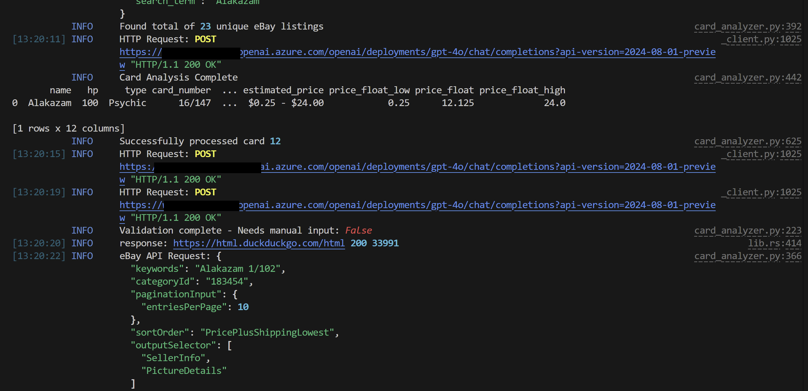
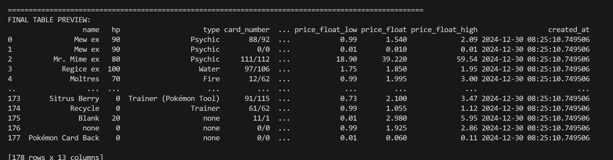
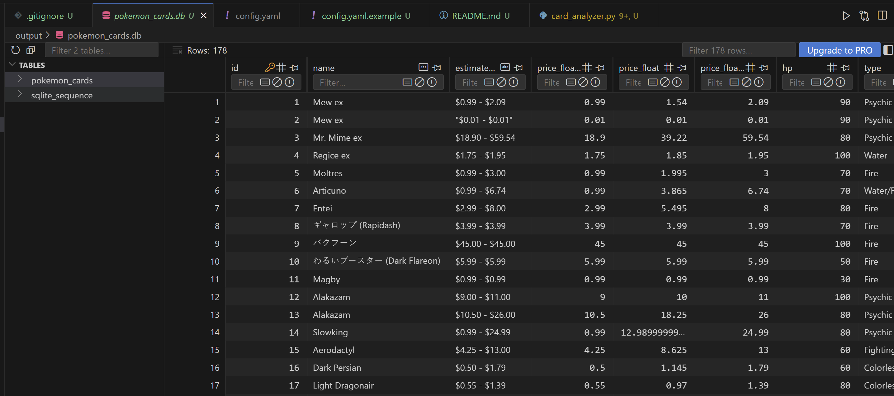
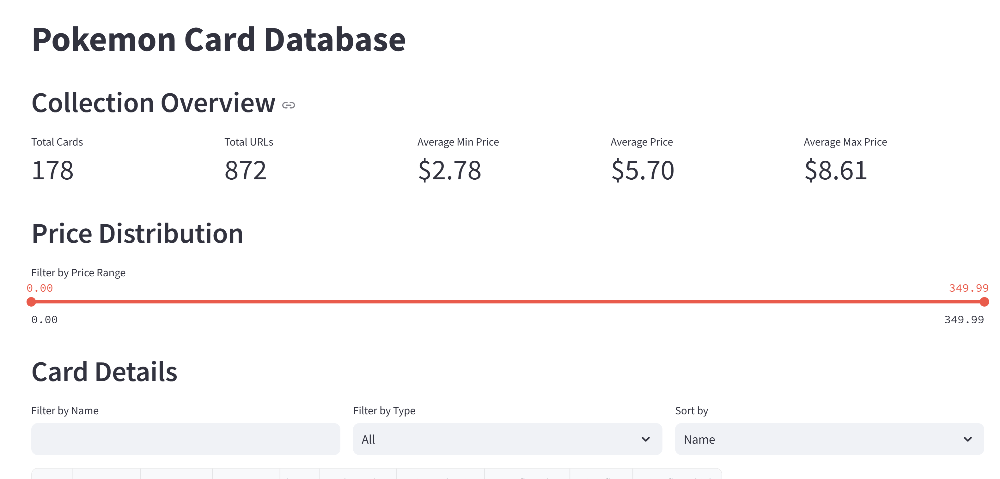
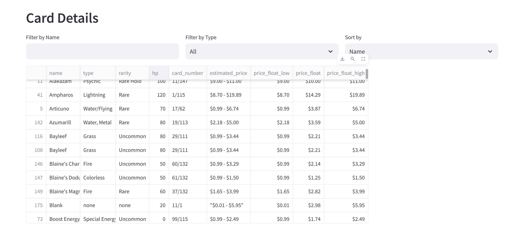
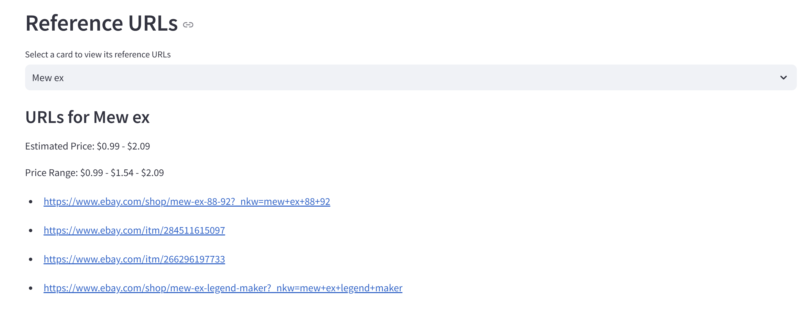

### About this project
Made this for my brothers who found their pokemon cards. Very terrible project but could come in handy for someone. 

Good way to ruin the vibe, thinking a collectible is worth more than it is 💯 

All it does is 
1. Take in PDF (cards are scanned 3 x 3)
2. Cards to images
3. Azure OpenAI vision to extract the card name and info. Has a validation step to make sure the info is correct. Makes you manually correct the info if it's not. You could prob turn validation step off if you want easily
4. Ebay API to search for the card, also duckduckgo search for some handy urls 
5. Return the card name, info, and ebay/other links
6. Make a nice sqlite db and also a cute streamlit app to display the cards. 

Uses Pydantic/instructor to extract structured data from the image. Uses Async Azure OpenAI to get the info and what not

### How to use
1. uv sync
2. uv run card_analyzer.py, then you will choose the folder with the pdfs

Make sure you have the ebay config stuff figured out. would recommend the prod one. This is for pokemon cards but you could easily modify it for other collectibles. 

### Scan collectibles to PDF 

### Async Azure OpenAI go brrr

